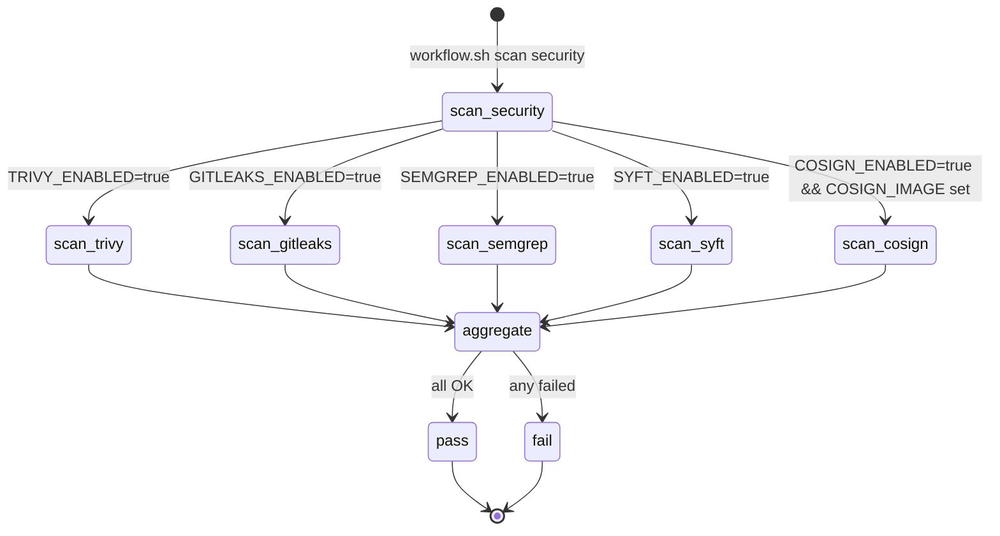

# DESIGN: sec-scan 镜像工具集成到 workflow skill

## Problem Statement

workflow skill 的 `scan security` 子命令目前仅集成了 trivy（依赖漏洞）和 gitleaks（密钥泄露）两个扫描器。
而 `ansible-ee-build` 项目的 sec-scan Docker 镜像预装了 5 个安全工具（Semgrep、Gitleaks、Trivy、Syft、Cosign），
workflow skill 遗漏了 Semgrep（SAST）、Syft（SBOM）、Cosign（签名验证）三个工具的集成。

缺少 Semgrep 意味着 SAST 静态代码安全分析在 workflow 中不可用，而这是 sec-scan 镜像的核心能力之一。

## User Stories

- As a developer, I want `scan security` to run Semgrep SAST analysis, so that code-level security vulnerabilities (OWASP Top 10, CWE) are caught before merge.
- As a DevOps engineer, I want to optionally enable Syft SBOM generation via config, so that software supply chain compliance is supported.
- As a DevOps engineer, I want to optionally enable Cosign image signature verification, so that container image integrity can be validated in the scan pipeline.

## User Flow



## Business Logic

### 1. 扫描器启用/禁用

每个扫描器通过 `<TOOL>_ENABLED` 环境变量控制，配置优先级：env > 项目 .spec-workflow.conf > 全局 ~/.spec-workflow.conf > 默认值。

| 扫描器 | 默认 | 说明 |
| ------ | ---- | ---- |
| Trivy | `true` | 依赖漏洞扫描（已有） |
| Gitleaks | `true` | 密钥泄露检测（已有） |
| Semgrep | `true` | SAST 静态分析（**新增**） |
| Syft | `false` | SBOM 生成（**新增**，按需开启） |
| Cosign | `false` | 镜像签名验证（**新增**，按需开启） |

### 2. 每个扫描器的 STRICT_MODE 行为

与现有 trivy/gitleaks 一致的三层判断：

| 条件 | STRICT_MODE=false | STRICT_MODE=true |
| ---- | ----------------- | ---------------- |
| 工具已安装 | 正常执行 | 正常执行 |
| 工具未安装 | warn + 跳过 (exit 0) | error + 失败 (exit 1) |
| 工具禁用 | 静默跳过 (exit 0) | 静默跳过 (exit 0) |

### 3. Cosign 双重门控

Cosign 比其他扫描器多一层前置条件：`COSIGN_IMAGE` 必须非空。

```
COSIGN_ENABLED=false → 跳过（静默）
COSIGN_ENABLED=true + COSIGN_IMAGE="" → 跳过（log_info 提示）
COSIGN_ENABLED=true + COSIGN_IMAGE="ghcr.io/..." → 执行验证
```

### 4. 默认参数

| 配置项 | 默认值 |
| ------ | ------ |
| `SEMGREP_ARGS` | `scan --config auto --error` |
| `SYFT_ARGS` | `dir:.` |
| `COSIGN_IMAGE` | _(空)_ |
| `COSIGN_ARGS` | `verify` |

### 5. JSON 输出扩展

`--json` 模式输出扩展为 5 个字段：

```json
{
  "trivy_passed": true,
  "gitleaks_passed": true,
  "semgrep_passed": true,
  "syft_passed": true,
  "cosign_passed": true,
  "status": "pass"
}
```

## 变更范围

仅修改 `agent-shared` 仓库（通过 bind mount 映射到 `~/.claude/skills/`）中的 workflow skill 文件：

| 文件 | 变更类型 | 内容 |
| ---- | -------- | ---- |
| `scripts/_config.sh` | 修改 | 新增 SEMGREP/SYFT/COSIGN 配置默认值 |
| `scripts/lib/security-scan.sh` | 修改 | 新增 scan_semgrep/scan_syft/scan_cosign 函数，更新 main() |
| `docs/commands/scan.md` | 修改 | 文档化 5 个扫描工具及其配置 |
| `tests/test_security_scan_strict_mode.sh` | 修改 | 覆盖新增扫描器的 strict/loose 行为 |
| `tests/test_workflow_scan_security_runner_task_mode.sh` | 修改 | 覆盖新增扫描器的 task-aware 模式 |

**不改动**：`ansible-ee-build` 仓库的任何文件（sec-scan 镜像本身是孤立的）。

## Acceptance Criteria

- [ ] `scan_semgrep()` 函数遵循现有 scan_trivy/scan_gitleaks 的 pattern（ENABLED 检查 → STRICT_MODE 降级 → run_cmd 远程支持）
- [ ] `scan_syft()` 函数同上 pattern，默认禁用
- [ ] `scan_cosign()` 函数实现双重门控（COSIGN_ENABLED + COSIGN_IMAGE）
- [ ] `main()` 聚合 5 个扫描结果，任一失败则整体失败
- [ ] JSON 输出包含 5 个 `_passed` 字段
- [ ] `_config.sh` 新增 6 个配置项（3 ENABLED + 3 ARGS/IMAGE）
- [ ] STRICT_MODE=false + 工具缺失 → 全部测试 pass
- [ ] STRICT_MODE=true + 工具缺失 → 全部测试 fail
- [ ] task-aware 模式下扫描失败正确阻断后续 stage
- [ ] 全部 10 个现有 workflow 测试保持通过（零回归）

## Open Questions

_(无)_
